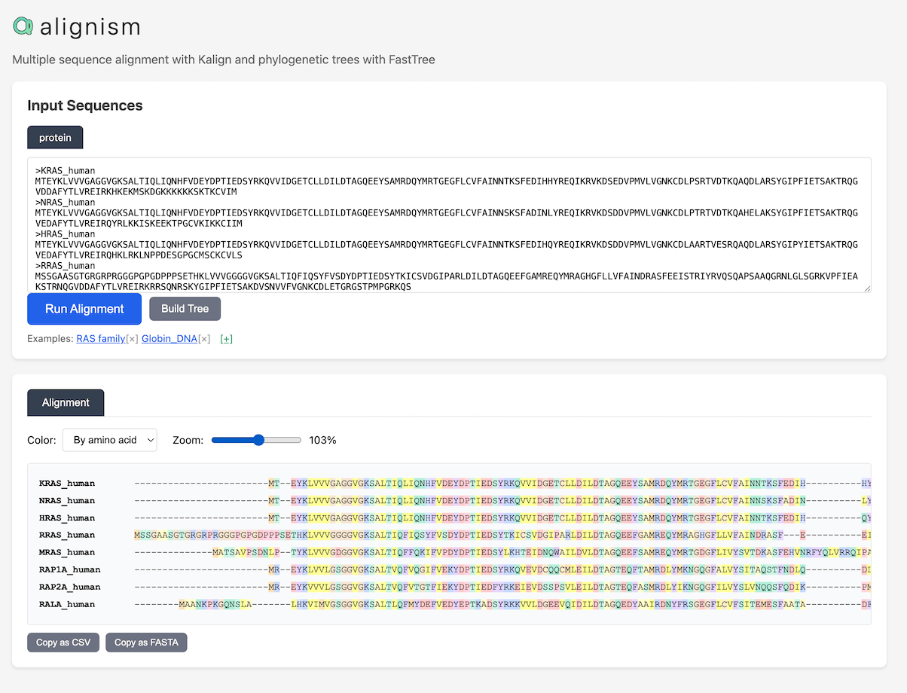

# Alignism

**[Try it live](https://hgbrian.github.io/alignism/)**

Multiple sequence alignment and phylogenetic tree visualization in the browser.

Runs **Kalign** for alignment and **FastTree** for tree building via [biowasm](https://biowasm.com/).

## Quick Start

Open the HTML file in your browser.
There is no server, no installation, no dependencies.
Everything runs in one index.html via WebAssembly.

## Features

- DNA and protein sequence alignment
- Auto-detection of sequence type
- DNA to protein translation
- Phylogenetic tree building
- Colored alignment display (by residue or biochemical property)
- Supports FASTA, raw sequences, and CSV/TSV input
- Kalign is fast and appears to work well. MAFFT and Muscla are also available on biowasm.com

## License

MIT
